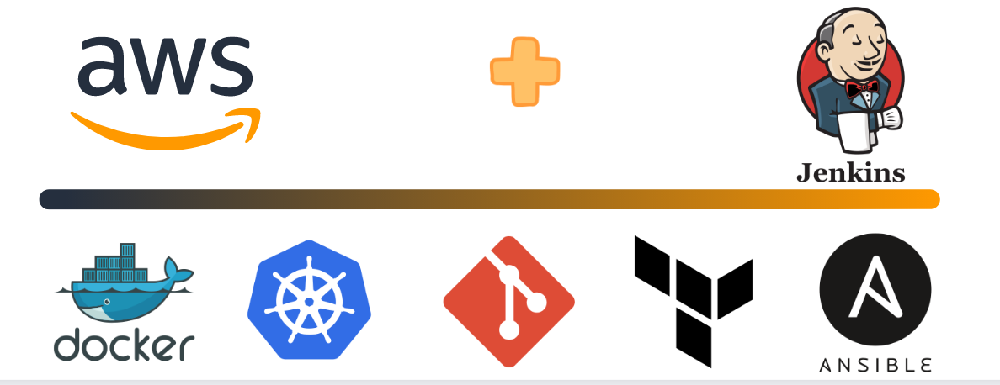
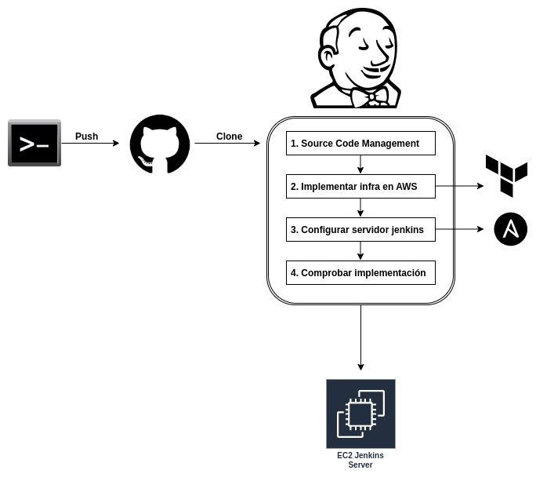
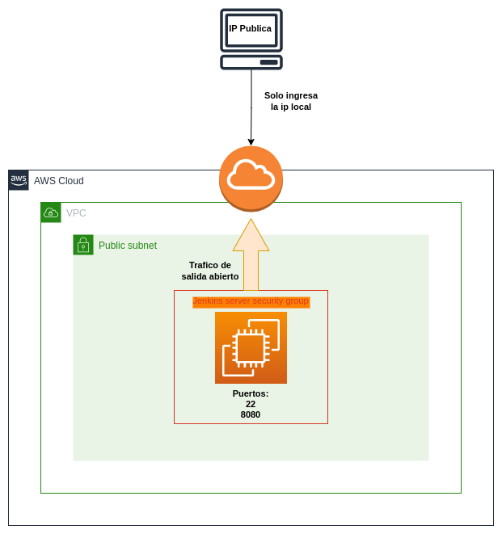
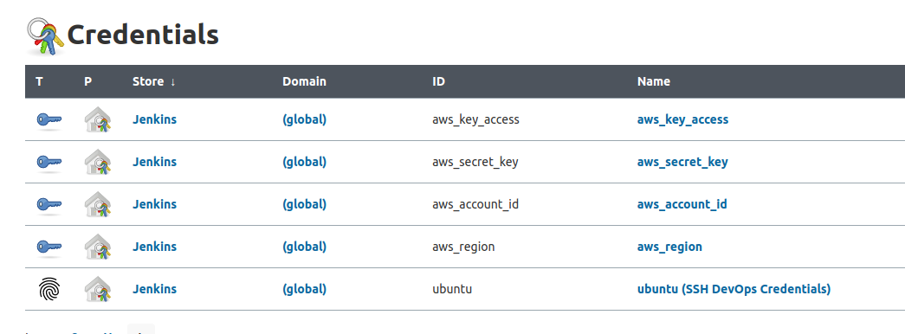
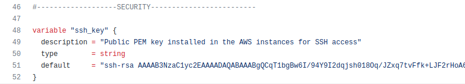
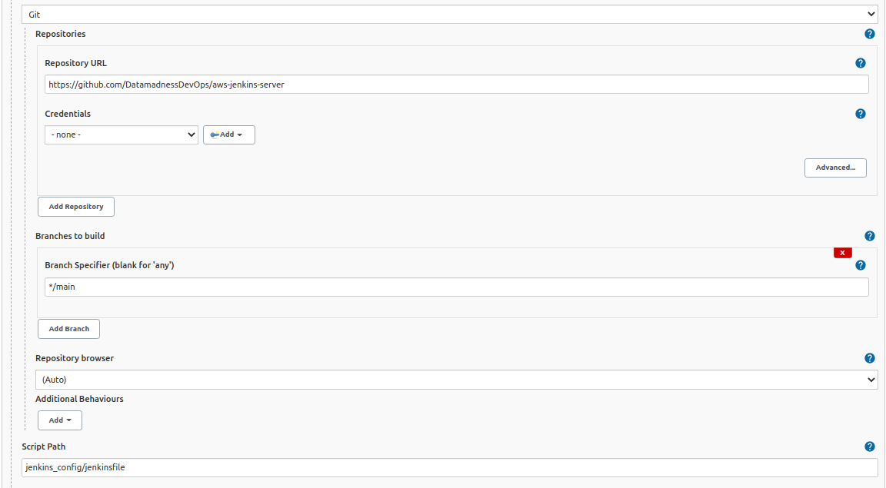
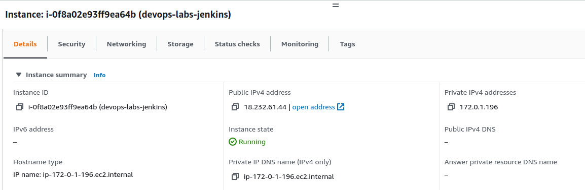
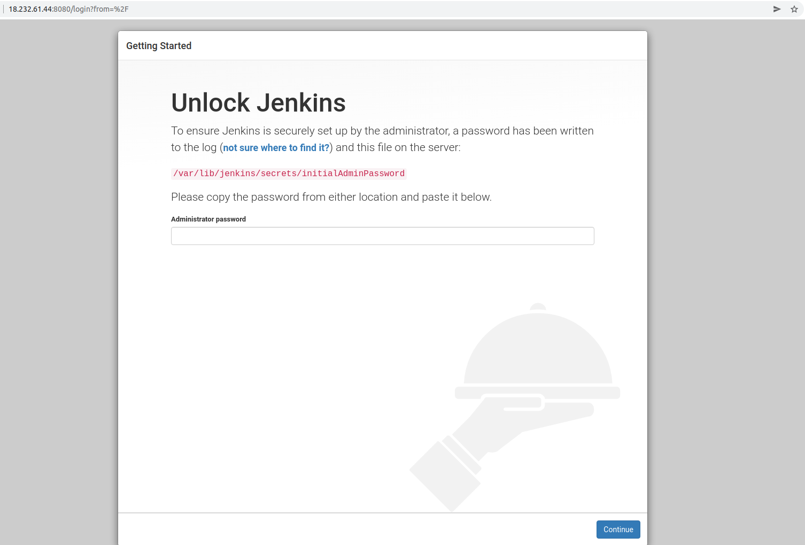
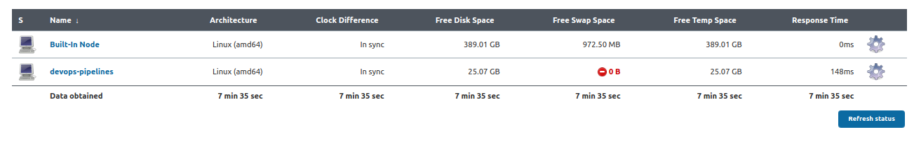
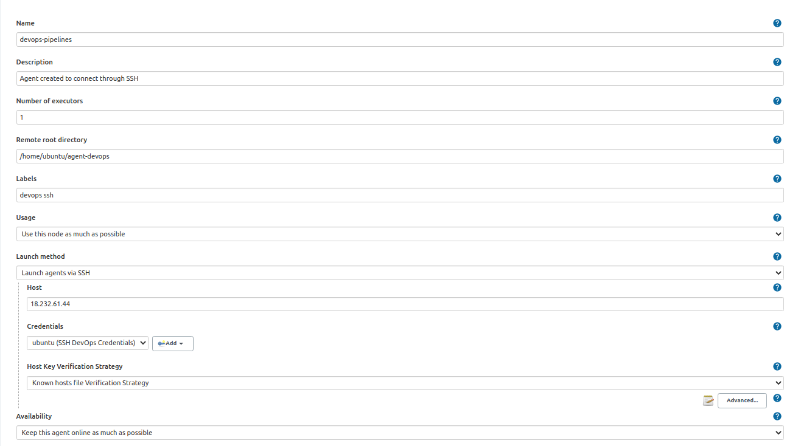

# IMPLEMENTAR SERVIDOR JENKINS EN UNA INSTANCIA EC2 EN AWS

### Descripción del laboratorio

Implementar en una instancia EC2 de AWS con sistema operativo Ubuntu, un servidor Jenkins que cuente con las herramientas necesarias para la automatización de infraestructuras cloud por medio de un pipeline Jenkins.
Cabe acotar que la propia implementación del servidor debe estar automatizada y correrá desde nuestro equipo local.

El laboratorio está propuesto para que pueda ser implementado con la capa gratuita de AWS, es decir, no generaría un costo siempre y cuando se cuente con disponibilidad en los servicios a utilizar.

 

### Objetivos del laboratorio

* Configurar un jenkinsfile con el pipeline de implementación del servidor en AWS.
* Crear un módulo en Terraform para construir la infraestructura y la instancia en  AWS.
* Configurar a través de un playbook de Ansible, las diferentes herramientas de automatización necesarias para un pipeline DevOps en la instancia AWS.

### Herramientas a utilizar

Para la realización del laboratorio debemos tener disponibles las siguientes herramientas en nuestro equipo:

* Jenkins.
* GIT.
* Terraform.
* Ansible.
* Cuenta AWS (capa gratuita).
 
 

### Diagrama del Pipeline  

  

 

### Diagrama del Jenkins Server  

  

 
 

## Pasos para ejecutar el laboratorio:

1. Configurar dentro de nuestro controlador Jenkins local, tanto las credenciales AWS como la llave privada PEM para poder acceder a los servicios AWS y a la instancia EC2 respectivamente. Esto evitará que tengamos que configurar y/o adjuntar dentro de los archivos del repositorio, claves, contraseñas o credenciales requeridas.
 
 

  

Para realizar esta configuración pueden seguir la documentación oficial en el siguiente enlace [The Correct Way to Handle Credentials in a Jenkins Pipeline](https://www.youtube.com/watch?v=yfjtMIDgmfs).

2. Hacer un fork o descargar el repositorio de GitHub para poder añadir en el archivo de Terraform variables.tf la llave privada PEM que estará instalada dentro de la instancia EC2. Esta llave es única para poder acceder a la instancia EC2 por lo que deben añadir una propia.
 
 

  

3. Configurar el pipeline de Jenkins para que tome los archivos de su repositorio en GIT y ejecute el jenkinsfile con cada uno de los stages.
 
 

  

4. Ejecutar el build en el controlador Jenkins local, con esto automáticamente debería crearse la instancia EC2 junto con las aplicaciones, librerías y configuraciones específicas para las siguientes herramientas (Ansible playbook):
   
    * AWSCLI.
    * Docker.
    * Kubernetes.
    * Ansible.
    * Terraform.
    * Jenkins (por supuesto!).
 
 

  
   
   
  

En este punto ya podemos configurar nuestro Jenkins Server en AWS para trabajar nuestros pipelines desde allí y detener o terminar la instancia cuando no se requiera de ella.

## Extra

Una buena práctica en el manejo de Jenkins es correr nuestros pipelines desde nuestro controlador local con un agente diferente al que trae el aplicativo por defecto (Built-In Node). Esto lo podemos configurar en nuestro Jenkins local luego de crear el Jenkins Server en AWS. Para hacerlo por favor seguir las indicaciones del siguiente video oficial [How to Create an Agent Node in Jenkins](https://www.youtube.com/watch?v=99DddJiH7lM) 

 
 

  
   
   
  

Esto nos permitirá hacer implementaciones en diferentes proyectos cloud que requieran Jenkins siempre desde nuestro equipo local.

## Colaboracion
Este laboratorio se creó con el fin de generar una base de conocimiento personal en lo relacionado con el aprendizaje de la infraestructura y herramientas cloud. Por tanto, serán bienvenidos tanto los aportes como las más que seguras correcciones a este repositorio.

## Contacto
* Twitter: [@data_madness](https://twitter.com/data_madness)

* Email: datamadness81@gmail.com

* Linkedin: [https://www.linkedin.com/in/john-ramireztech/](https://www.linkedin.com/in/john-ramireztech/)